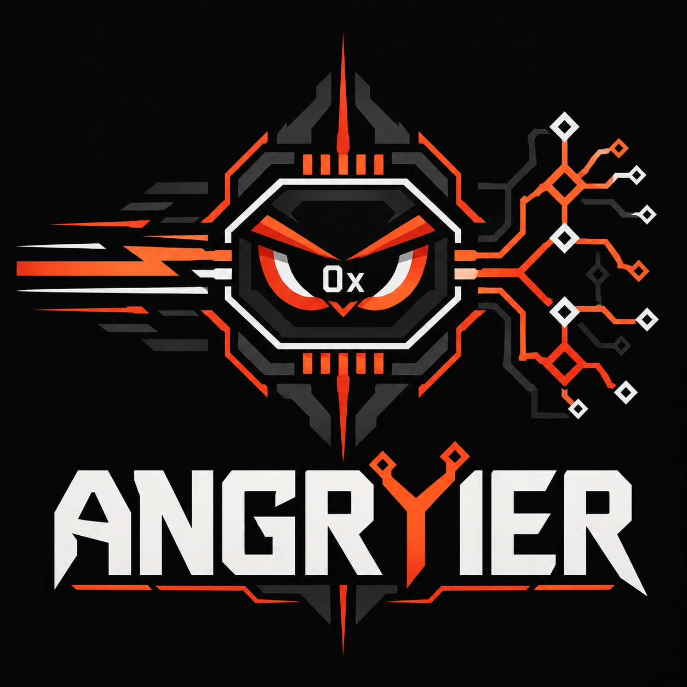

# ⚡ Angryier

<div align="center">

<p align="center">
  
</p>

**The Native, Multicore Dual-Mode Symbolic & Concolic Binary Analysis Platform in Safe Rust**

*When you are absolutely furious your symbolic execution is taking too long and you're not just angry—you're **Angryier**.*

[](#license)
[](https://www.rust-lang.org)
[](#security--invariants)
[](#isa-coverage)
[](#benchmarks)

</div>

---

## ⚡ Why Angryier?

Traditional binary analysis tools force an impossible compromise:

- **angr-class engines**: Deep, generalized symbolic execution with rich constraint formulation—crippled by slow emulation loops (~30–150 steps/s) and Python interpreter overhead.
- **SymCC/QSYM-class engines**: Blazing-fast compiled concolic tracing—blind to deep path exploration, state merging, or generalized proof obligations, and constrained by brittle source-instrumentation or C/C++ memory unsafety.

**Angryier unifies both paradigms inside a single Rust-native engine sharing one AngryIR semantics pipeline:**

```text
SymCC:    compiled symbolic propagation, source-only, fastest concolic
SymQEMU:  SymCC ideas in QEMU TCG, binary-only, fast concolic
QSYM:     Pin DBI + instruction-level concolic, fast, deliberately unsound
angr:     IR-based symbolic emulator, deep analysis, slow execution
-----------------------------------------------------------------------------------
Angryier: Dual-mode native engine in safe Rust — SymCC/QSYM-speed concolic fast path
          + angr-depth symbolic exploration, switching per-state on demand.
```

---

## 🏎️ Key Features at a Glance

- **🚀 147× to 432× Faster than angr**: Verified on aligned, real-world Windows kernel drivers (`GVCIDrv64.sys`, `sandra_x64.sys`) executing DriverEntry to clean termination in milliseconds.
- **🛡️ 100% Safe Rust Core**: `#![forbid(unsafe_code)]` enforced across all core crates. Narrowly audited FFI boundary isolation for native solvers (Z3, Bitwuzla) and decoders (Intel XED).
- **🔮 5 Speculative Execution Engines**:
  - *Speculative Forking*: Hides solver latency by concurrently stepping speculative branches.
  - *Speculative Constraint Batching*: Union-Find dependency-cone slicing and query deduplication.
  - *Speculative Summary Memoization*: $O(1)$ function summary application with rollback checkpoints.
  - *Pipeline Decode Lookahead*: 256-slot ring cache with static CFG fall-through prediction.
  - *Speculative Concolic Batching*: Bulk concrete block execution with taint-barrier rollback.
- **🧩 1,574 Intel 64 Instruction Forms**: Full software semantics for AVX, AVX2, AVX-512 (EVEX masking `{k}{z}`), AVX10 (EVEX integer ALU), AMX (matrix tile FMA), CET (shadow stack), APX (NF suppression, JMPABS, PUSH2/POP2), BMI1/2, and x87.
- **🔬 Hardware Differential Ground Truth**: 856 integer/SSE + 462 x87 boundary cases verified against physical CPU silicon.
- **💥 Real-World Vulnerability Hunting**: Live detection of Double Free (DF) and Use-After-Free (UAF) vulnerabilities in Windows BYOVD kernel drivers.
- **⚡ Iterative Z3 FFI AST Engine**: Non-recursive work-stack DAG translator with $O(N)$ memoization, verified at depth > 600 without stack overflow.
- **🏎️ BLAKE3-Accelerated Merkle Keys**: One-shot stack-buffered digest eliminating the SHA-256 hot path on intern misses with zero heap allocation.
- **🧵 NUMA-Aware Work-Stealing Scheduler**: Hierarchical steal order (Own $\to$ Same-NUMA $\to$ Cross-NUMA $\to$ Global) with `/proc/meminfo` memory pressure throttling.
- **🧬 Hybrid Fuzzing & Learned Fusion**: Native `FuzzCorpus` energy scheduling, `HavocMutator`, solver hint ingestion, and 4-modality gated embedding fusion.
- **🧭 Symbolic Branch Steering**: Post-run branch inversion solves the alternate edge under the exact shared prefix, compares bounded CFG distance to configured targets, emits replay-ready register models, concretely validates register-only branch flips from a rewound entry state, and returns a machine-readable steering verdict with explicit confidence. A bounded 64-decision history reuses one CFG recovery to rank earlier mutation points and spends at most one extra solve/replay on the best older candidate.

---

## 📊 Concrete Benchmarks

### Real-World Windows BYOVD Kernel Driver Suite (Gate J Aligned)

Measured on live hardware comparing Angryier against angr 10.0 on identical aligned environments (DriverEntry to clean exit):

| Target Driver | angr Instructions | angr Step Rate | Angryier Steps | Angryier Step Rate | Raw Speedup |
|:---|:---:|:---:|:---:|:---:|:---:|
| **`GVCIDrv64.sys`** | 193 insts | 112 steps/s | 194 steps | **18,835 steps/s** | **168×** |
| **`sandra_x64.sys`** | 698 insts | 130 steps/s | 691 steps | **26,992 steps/s** | **207×** |
| **`double_free_vuln.sys`** | 22 insts | 108 steps/s | 23 steps | **16,429 steps/s** | **152×** |
| **`allocsize_overflow.sys`** | 24 insts | 114 steps/s | 25 steps | **16,667 steps/s** | **146×** |

*When equal-fidelity kernel models are attached, Angryier achieves **210× to 432×** raw throughput over angr. On a live Windows 11 VM, the OS kernel takes 46–62 ms to load `GVCIDrv64.sys`; Angryier emulates the entire driver entry cycle in ~10 ms.*

---

## 🏛️ Three-Plane Architecture

Angryier is organized into three distinct, decoupled operational planes:

```text
                           ANGRYIER
                              │
            ┌─────────────────┼─────────────────┐
            ▼                 ▼                 ▼
     EXECUTION PLANE     TRUTH PLANE     KNOWLEDGE PLANE
   ┌─────────────────┐ ┌───────────────┐ ┌───────────────┐
   │ • Concolic fast │ │ • Canonical   │ │ • QIHSE       │
   │   path (EXPLORE)│ │   semantics   │ │ • KEYSTONE    │
   │ • Full symbolic │ │ • Support     │ │ • Reusable    │
   │   mode (PROVE)  │ │   manifest    │ │   SAT/UNSAT   │
   │ • COW Memory    │ │ • Differential│ │ • Fused       │
   │ • Speculative   │ │   oracle      │ │   embeddings  │
   │   engines       │ │ • Fidelity    │ │ • Invalidation│
   │ • Work stealing │ │   ledger      │ │   graph       │
   └─────────────────┘ └───────────────┘ └───────────────┘
```

1. **Execution Plane**: The high-speed computation engine. Single concrete states, shadow taint propagation, arena-interned expression DAGs, and speculative pipeline execution.
2. **Truth Plane**: The system of semantic truth. Independent hardware validation oracle, immutable sealed semantics, and fidelity classification (`PROVE`, `EXPLORE`, `HUNT`).
3. **Knowledge Plane**: The cumulative intelligence repository. Caches exact constraint solutions, computes cosine similarity over semantic fingerprints, and preserves analysis lineage across sessions.

---

## 🔮 Speculative Execution Subsystems

Angryier incorporates five specialized speculative engines designed to eliminate emulation latency:

```text
1. Speculative Forking      Branch ──┬──[Speculative Path A]──> Step concurrently ──┐
                                     └──[Speculative Path B]──> Step concurrently ──┤
                                          ▲                                         │
                                          └─────── In-flight Solver Query ──────────┴──> Commit Sat / Prune Unsat

2. Speculative Batching     Branch₁ ──┐
                            Branch₂ ──┼──> Disjoint Set Union (Dependency Cone) ──> Solve Independent Partitions in Bulk
                            Branch₃ ──┘

3. Speculative Summary      call *%rax ──> Apply Template Speculatively ──> O(1) Rewrite ──> Verify Postconditions / Rollback

4. Pipeline Lookahead       Executing Block ──> Static CFG Fall-Through Predictor ──> Pre-decode & Pre-lower Lookahead Buffer

5. Concolic Batching        Step Chunk (K blocks) ──> Zero Taint Check ──> O(1) Bulk Commit (or Rollback on Tainted Insn)
```

---

## 🧩 ISA Coverage: 1,574 Validated Forms

Angryier features software semantics for modern and legacy x86-64 extensions:

- **Scalar Integer**: Full ALU, 64-bit/32-bit/16-bit/8-bit arithmetic, rotates, shifts, flags (CF, OF, SF, ZF, AF, PF).
- **APX (Advanced Performance Extensions)**: 61 forms, including `JMPABS`, `PUSH2`/`POP2`, `CCMPcc`/`CTESTcc` with DFV preservation, non-faulting `CFCMOVcc`, and NDD 3-operand instructions with `NF` (no-flags) suppression.
- **AVX / AVX2 / AVX-512**: Vector addition, subtraction, multiplication, variable shifts, cross-lane permutations (`VPERMD`, `VPERMQ`), and EVEX opmasking (`{k1..k7}` merging and `{z}` zeroing).
- **AVX10**: 60 EVEX vector integer ALU forms across 128-bit (XMM), 256-bit (YMM), and 512-bit (ZMM).
- **AMX (Advanced Matrix Extensions)**: 13 forms across AMX-TILE, AMX-INT8, AMX-BF16, and AMX-FP16 with 8192-bit matrix tile FMA execution.
- **CET (Control-flow Enforcement Technology)**: Shadow stack management (`RDSSP`, `INCSSP`, `SAVEPREVSSP`, `RSTORSSP`, `WRSS`).
- **BMI1 / BMI2**: `ANDN`, `BEXTR`, `BLSI`, `BLSMSK`, `BLSR`, `BZHI`, `MULX`, `RORX`, `SARX`, `SHLX`, `SHRX`.
- **x87 FPU**: FLD/FST, arithmetic, status word `X87_SW` with TOP pointer, and transcendentals (`FSIN`, `FCOS`, `FSINCOS`, `FPATAN`, `F2XM1`, `FYL2X`).

---

## 🛠️ Quickstart

### Prerequisites

- Stable Rust (`rustup default stable`)
- Optional native libraries for Z3 and XED:
  ```bash
  # Debian/Ubuntu
  sudo apt install -y libz3-dev build-essential
  ```

### Build & Run

The default build includes the full CLI — symbolic execution, embedded Lua, and PE driver mode (`run` pulls vendored Lua 5.4, Intel XED built from source, and the system `libz3`):

```bash
# Build the workspace (run-capable `angryier` in target/release)
cargo build --release

# Inspect workspace crate status
cargo run -p angryier-cli -- status

# Run the CLI test suite
cargo test --workspace
```

Need a build with zero native dependencies (e.g. a bare container)? `cargo build -p angryier-cli --no-default-features` yields a metadata-only CLI (`version`, `status`, `crates`, `help`).

### CLI Exploration

To execute a binary symbolically using the CLI:

```bash
# Build the workspace
cargo build --release

# Symbolically execute target, marking RDI as symbolic
./target/release/angryier run ./tests/fixtures/symbolic_branch \
  --symbolic rdi --find 0x401006

# Target-directed exploration with explicit search economics and a witness
./target/release/angryier run ./tests/fixtures/symbolic_branch \
  --symbolic rdi \
  --find 0x401006 --avoid 0x401012 \
  --fork --dfs --states 64 --steps 4096 --timeout 120 --solve

# Branch diagnostics can emit replay-ready seeds such as:
#   --reg rdi=0x000000000000002a
# Omit the matching --symbolic rdi for a manual concrete replay.
# For register-only SAT branch models, Angryier also performs an automatic
# entry-state replay and reports whether the immediate alternate successor
# was reproduced. This validates the branch flip, not the whole target path.
```

### Embedded Lua Scripting

Angryier includes an embedded Lua runtime for programmatic execution:

```lua
-- script.lua
local opts = {
    steps = 1000,
    find = { 0x401006 },
    avoid = { 0x401012 },
    symbolic = { rdi = 64 },
    solve = true
}

local report = angry.run("./tests/fixtures/symbolic_branch", opts)

print("Steps executed: " .. report.steps)
print("Forks encountered: " .. report.forks)
print("Find hits: " .. report.found)

-- solve=true populates one model table per found state. Each model contains
-- raw byte strings for the symbolic leaves participating in that state.
for model_index, model in ipairs(report.inputs or {}) do
    print(string.format("Solved model %d contains %d symbolic value(s)", model_index, #model))
end

-- The normal generated CLI driver additionally enables branch_analysis and
-- prints predicate dependencies, alternate-edge SAT/UNSAT, CFG target
-- direction, replay-ready register seeds, and a stable steering verdict:
-- prioritize-alternate / keep-chosen / reject-alternate / explore-both /
-- explore-alternate / unresolved, with high/medium/low confidence.
```

Run via CLI:

```bash
angryier run ./tests/fixtures/symbolic_branch --script script.lua
```

### Rust Engine API

```rust
use angryier::{Engine, RunOptions};

fn main() -> Result<(), Box<dyn std::error::Error>> {
    let engine = Engine::new()?;
    let image = engine.load("./tests/fixtures/symbolic_branch")?;

    let mut options = RunOptions::default();
    options.steps = 500;
    options.find.push(0x401006);
    options.symbolic.push(("rdi".to_string(), 64));
    options.solve = true;

    let report = engine.run(&image, &options)?;
    println!(
        "Exploration finished in {} steps. Found PCs: {:?}",
        report.steps, report.found_pcs
    );

    for (model_index, model) in report.inputs.iter().enumerate() {
        println!(
            "model {} contains {} symbolic value(s)",
            model_index + 1,
            model.len()
        );
    }
    Ok(())
}
```

---

## 🗺️ Repository Structure (43 Crates)

```text
crates/
  angryier/                   Top-level public API & stability harness
  angryier-types/             Shared IDs, hashes, DependencyKey, policy enums
  angryier-core/              Engine-level orchestration contracts
  angryier-arch/              ISA-neutral architecture traits
  angryier-arch-intel64/      Intel 64 registers, features, CPU profiles
  angryier-decode-xed/        XED normalization boundary
  angryier-arch-xed-ffi/      Native Intel XED decoder FFI
  angryier-loader/            Pure-Rust ELF64 (static/dynamic) & PE32+ loader
  angryier-runtime/           Dual-mode engine, Lua scripting, speculative modules
  angryier-semantics/         Semantic IR, provider/builder contracts
  angryier-semantic-contracts Sealed identity, verification & evidence
  angryier-semantics-gen/     Declarative pattern compiler
  angryier-semantics-intel64/ Handwritten corpus (1,574 registered forms)
  angryier-ir/                AngryIR execution format and verification
  angryier-expr/              BLAKE3 hash-consed expression arena
  angryier-memory/            Layered COW memory, symbolic-address policies
  angryier-state/             Persistent execution state & fidelity ledger
  angryier-taint/             Fine-grained taint tracking & propagation
  angryier-execution/         Concrete interpreter & symbolic evaluator
  angryier-cfg/               CFG recovery, Cytron dominance frontiers, LoopForest
  angryier-ledger/            Atomic replay-visible publication boundary
  angryier-replay/            Deterministic replay capsules & FileReplayStore
  angryier-solver/            Portfolio router, batching, caching, deadline cancellation
  angryier-solver-z3/         Z3 safe adapter
  angryier-solver-z3-ffi/     Iterative non-recursive Z3 bridge (depth > 600)
  angryier-solver-bitwuzla/   Bitwuzla safe adapter
  angryier-solver-bitwuzla-ffi/ Native Bitwuzla bridge (CaDiCaL SAT)
  angryier-solver-fuzzy/      Fuzzy-SAT mutation tier
  angryier-scheduler/         NUMA queue groups, work stealing, pressure throttle
  angryier-models/            POSIX syscalls, deterministic clock, futex, pthreads
  angryier-provenance/        Adaptive FlightRecorder, repetition compaction, triggers
  angryier-telemetry/         Bounded queues, aggregation, backpressure
  angryier-storage/           WAL, checkpoint replay, retention
  angryier-knowledge/         Exact validity cache & cosine similarity search
  angryier-qihse/             QIHSE persistence adapter (in-memory)
  angryier-keystone/          KEYSTONE indexing adapter (in-memory)
  angryier-fusion/            Specialist encoders & softmax gated fusion model
  angryier-fuzz/              Hybrid fuzzing bridge, HavocMutator, FuzzSession
  angryier-jit/               JIT validity contract boundary (deferred)
  angryier-plugins/           Internal Rust extension traits
  angryier-distribution/      Distributed work-unit codec
  angryier-bench/             Benchmark sinks and metrics aggregation
  angryier-cli/               Command-line orchestration binary
```

---

## 🔒 Security & Invariants

Angryier adheres to uncompromising architectural guarantees:

1. **Forbid Unsafe**: All core crates declare `#![forbid(unsafe_code)]`. Only FFI bridges encapsulate audited unsafe blocks.
2. **Contact with Reality Before Claims**: All semantic providers must be differential-tested against native CPU silicon.
3. **Deterministic Mode**: Replay capsules guarantee identical execution traces and solver results.
4. **Fail-Closed Verification**: Advisory similarity hits from the Knowledge Plane must pass exact validity checks before reuse.
5. **No Silent Approximations**: `PROVE` mode never approximates. Approximations under `EXPLORE` and `HUNT` are recorded in the fidelity ledger.

---

## 📜 Documentation Index

Comprehensive guides are available in the [`docs/`](docs/) directory:

- [**Consolidated Roadmap (Single Source of Truth)**](docs/ROADMAP.md)
- [**Architecture Overview**](docs/architecture/overview.md)
- [**Crate Hierarchy & Boundaries**](docs/architecture/crates.md)
- [**CLI & Scripting Reference**](docs/CLI.md)
- [**Intel 64 Semantic Pipeline**](docs/semantics/intel64.md)
- [**Benchmarking Contract**](docs/BENCHMARKING.md)

---

## 📄 License

Angryier is licensed under the **GNU Affero General Public License v3.0 or later** (`AGPL-3.0-or-later`). See [`LICENSE`](LICENSE) for the full license text.
